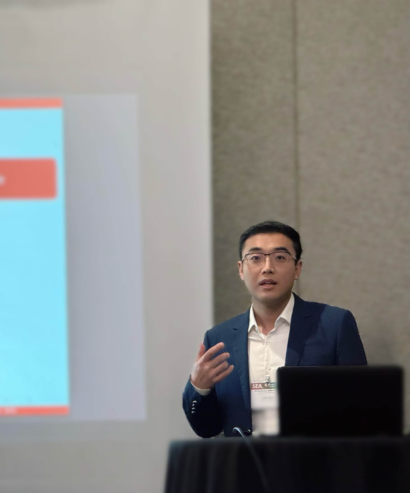

::: {.name-banner}

Wei Guo

Economics · Purdue University

:::

::: {.homepage-main}

::: {.homepage-photo}

{.profile-photo}

:::

::: {.homepage-about}

## Welcome to my academic website!

I am a **Ph.D. Candidate(5th year) in Economics at Purdue University**. I am affiliated with the [**Center for Inflation and Price Research**](https://business.purdue.edu/centers/center-for-inflation-and-price-research/people.php){.intro-link}.

My research lies at the intersection of **International Trade, Industrial Organization, and Macroeconomics**. I study trade and industrial policy, semiconductor markets, innovation, production networks, and firm behavior.

My current research examines how restrictions on strategic technologies affect international trade, firms' production and innovation decisions, and economic welfare.

[Curriculum Vitae](Wei.pdf){.intro-link}

[Google Scholar](https://scholar.google.com/citations?user=JTBf1YQAAAAJ&hl=zh-CN){.intro-link} ·
[LinkedIn](https://www.linkedin.com/in/wei-guo-b90880364/){.intro-link} ·
[Email](mailto:guo720@purdue.edu){.intro-link}

:::

:::